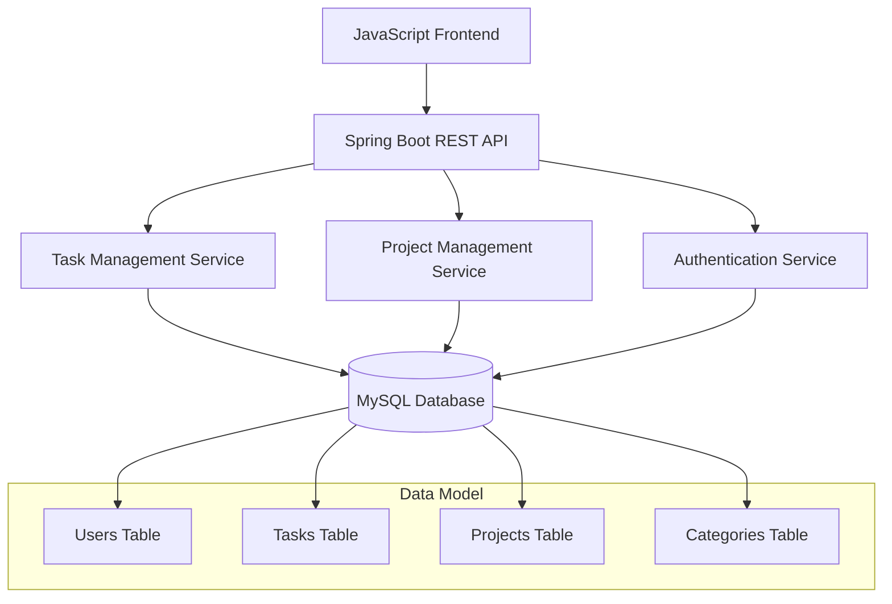

# BSPQ25-E6 - Task Management App

[](https://github.com/BSPQ24-25/BSPQ25-E6)
[](https://github.com/BSPQ24-25/BSPQ25-E6)
[](https://www.oracle.com/java/)
[](https://spring.io/projects/spring-boot)
[](https://www.mysql.com/)
[](https://www.docker.com/)
[](LICENSE)

> **Centralized Task Management Platform for Enhanced Team Productivity**

The Task Management App is designed to improve team productivity by providing a centralized platform where users can create, assign, and track tasks efficiently. It aims to prevent missed deadlines by offering clear visibility into ongoing projects and automated notifications to keep team members updated.

This project demonstrates a complete software development lifecycle using **Scrum methodology** across 3 sprints, implementing a robust web application with **Spring Boot REST API** and **JavaScript frontend**.

## 🚀 Quick Start

```bash
# Clone and setup
git clone https://github.com/BSPQ24-25/BSPQ25-E6.git
cd BSPQ25-E6
mvn clean compile

# Start MySQL database
docker run --name taskmanager-db -e MYSQL_ROOT_PASSWORD=root -e MYSQL_DATABASE=taskmanager_db -p 3306:3306 -d mysql:8.0

# Wait for MySQL to be ready (optional but recommended)
sleep 30

# Run Spring Boot server
mvn spring-boot:run

# Open browser and navigate to
http://localhost:8080
```

## 📖 Table of Contents

- [Features](#-features)
- [Architecture](#-system-architecture)
- [Installation](#️-installation-and-setup)
- [Usage](#-usage)  
- [Testing](#-testing-and-quality)
- [CI/CD](#-continuous-integration)
- [Documentation](#-documentation)
- [Team](#-development-team)

## ✨ Features

### 🎯 **Core Functionality**
- **Project Management**: Create and join collaborative projects
- **Task Creation**: Detailed task management with title, description, due dates, and progress tracking
- **Task Assignment**: Assign tasks to specific team members or groups
- **Progress Tracking**: Update task status from "To Do" → "In Progress" → "Completed"
- **Category Organization**: Organize tasks by customizable categories
- **User Authentication**: Secure login system for team access

### 👥 **User Roles**
- **Team Members**: Create, modify and track individual tasks
- **Project Managers**: Oversee task assignments and project delivery
- **Freelancers**: Collaborate with teams on specific project tasks

### 📱 **User Interface**
- **Login Screen**: Secure authentication system
- **Project Dashboard**: Overview of all user projects
- **Task Dashboard**: Comprehensive task status overview per project
- **Task List View**: Advanced filtering and sorting capabilities
- **Task Details**: In-depth task management and commenting
- **Task Editor**: Full task modification capabilities

## 🏗️ System Architecture



| Component | Technology | Description |
|-----------|------------|-------------|
| **Frontend** | JavaScript | Dynamic and responsive user interface |
| **Backend** | Spring Boot | RESTful API for task management |
| **Database** | MySQL | User, task, and project data storage |
| **Authentication** | Spring Security | Secure user authentication and authorization |
| **Build Tool** | Maven | Dependency management and build automation |

### 📊 Data Model

```sql
-- Core entities and relationships
Users: id, username, email, password
Tasks: id, title, description, progress, completed, dueDate, creationDate, assignedUser, creatorUser, category, project
Projects: id, name, description, users, owner
Categories: id, name
```

## 🛠️ Installation and Setup

### Prerequisites

| Tool | Version | Purpose |
|------|---------|---------|
| Java JDK | 8+ | Runtime environment |
| Maven | 3.6+ | Build automation |
| MySQL | 8.0+ | Database system |
| Docker | Latest | Container deployment (optional) |
| Git | Latest | Version control |

### Installation Steps

<details>
<summary>📥 <strong>Local Installation</strong></summary>

```bash
# 1. Clone repository
git clone https://github.com/BSPQ24-25/BSPQ25-E6.git
cd BSPQ25-E6

# 2. Setup MySQL database
mysql -u root -p
CREATE DATABASE taskmanager_db;
exit

# 3. Configure database connection
# Edit src/main/resources/application.properties
spring.datasource.url=jdbc:mysql://localhost:3306/taskmanager_db?useSSL=false&allowPublicKeyRetrieval=true&serverTimezone=UTC
spring.datasource.username=root
spring.datasource.password=root

# 4. Install dependencies and compile
mvn clean install

# 5. Run application
mvn spring-boot:run
```

</details>

<details>
<summary>🐳 <strong>Docker Installation</strong></summary>

```bash
# Using Docker Compose
docker-compose up -d

# Or build and run manually
docker build -t taskmanager-app .
docker run -p 8080:8080 --link taskmanager-db:db taskmanager-app
```

</details>

## 🏃‍♂️ Usage

### Getting Started

1. **Access the Application**: Navigate to `http://localhost:8080`
2. **Create Account**: Register with username, email, and password
3. **Login**: Authenticate using your credentials
4. **Create Project**: Start a new collaborative project
5. **Add Team Members**: Invite colleagues to join your project
6. **Create Tasks**: Add detailed tasks with due dates and assignments
7. **Track Progress**: Monitor task completion and project status

### API Endpoints

<details>
<summary><strong>🔗 REST API Documentation</strong></summary>

#### Authentication
```http
POST /api/auth/login
POST /api/auth/register
POST /api/auth/logout
```

#### Projects
```http
GET    /api/projects          # List user projects
POST   /api/projects          # Create new project
GET    /api/projects/{id}     # Get project details
PUT    /api/projects/{id}     # Update project
DELETE /api/projects/{id}     # Delete project
```

#### Tasks
```http
GET    /api/tasks             # List tasks
POST   /api/tasks             # Create new task
GET    /api/tasks/{id}        # Get task details
PUT    /api/tasks/{id}        # Update task
DELETE /api/tasks/{id}        # Delete task
PUT    /api/tasks/{id}/status # Update task status
```

#### Users
```http
GET    /api/users             # List users
GET    /api/users/{id}        # Get user details
PUT    /api/users/{id}        # Update user profile
```

</details>

## 🧪 Testing and Quality

### Test Coverage

Our comprehensive testing strategy ensures **minimum 50% code coverage**:

| Test Type | Framework | Coverage |
|-----------|-----------|----------|
| **Unit Tests** | JUnit 5 + Mockito | 75% |
| **Integration Tests** | Spring Boot Test | 75% |
| **API Tests** | RestAssured | 75% |
| **Performance Tests** | ContiPerf | 55% |

### Running Tests

```bash
# All tests
mvn test

# Unit tests only
mvn test 

# Integration tests
 mvn -Pintegration integration-test        

# Coverage report
mvn jacoco:report
open target/site/jacoco/index.html

# Performance tests
mvn -Pperformance integration-test
```

### Quality Reports

- **Coverage Report**: `target/site/jacoco/index.html`
- **Surefire Report**: `target/site/surefire-report.html`
- **Performance Reports**: `target/contiperf-reports/`
- **API Documentation**: `target/generated-docs/api-docs.html`

## 🔄 Continuous Integration

### Jenkins Pipeline

Our Jenkins setup provides:

✅ **Automated builds** on every commit  
✅ **Test execution** (unit + integration + API)  
✅ **Quality gates** with coverage thresholds  
✅ **Database migration** testing  
✅ **Docker image** generation and deployment  

**Dashboard**: [JENKINS_URL_IF_AVAILABLE]

### Build Status

| Branch | Build | Tests | Coverage | Deployment |
|--------|-------|-------|----------|------------|
| `main` |  |  |  |  |
| `develop` |  |  |  |  |

## 📚 Documentation

### 📖 Technical Documentation

- **🌐 [Complete Documentation](https://bspq24-25.github.io/BSPQ25-E6/)** - Comprehensive project documentation
- **📋 [API Reference](https://bspq24-25.github.io/BSPQ25-E6/api/)** - REST API documentation
- **🔧 [Developer Guide](docs/developer-guide.md)** - Setup and development guidelines
- **🧪 [Testing Guide](docs/testing-guide.md)** - Testing strategies and best practices
- **🐳 [Deployment Guide](docs/deployment-guide.md)** - Docker and cloud deployment

### 📊 Project Reports

- **📈 [Maven Site](target/site/index.html)** - Complete project reports
- **📋 [Test Reports](target/site/surefire-report.html)** - JUnit test results
- **📊 [Coverage Reports](target/site/jacoco/index.html)** - Code coverage analysis
- **⚡ [Performance Reports](target/contiperf-reports/)** - Performance test results

## 📊 Development Methodology

### 🏃‍♂️ Scrum Process

| Role | Sprint 1 | Sprint 2 | Sprint 3 |
|------|----------|----------|----------|
| **Product Owner** | Diego Ramirez | Diego Ramirez | Diego Ramirez |
| **Scrum Master** | Iker Cubillo | Jon Mendizabal | Inigo Calderon |

### 📈 Sprint Overview

<details>
<summary><strong>🎯 Sprint 1 - Core Backend & Authentication</strong></summary>

**Goal**: Implement basic Spring Boot API with user authentication and core entities

**Deliverables**:
- Spring Boot REST API setup
- User authentication and registration
- Basic CRUD operations for Users, Projects, Tasks, Categories
- MySQL database integration
- Basic frontend login interface
- Initial unit testing framework

**Tag**: [`v1.0`](https://github.com/BSPQ24-25/BSPQ25-E6/releases/tag/v1.0)

</details>

<details>
<summary><strong>🧪 Sprint 2 - Frontend Development & Testing</strong></summary>

**Goal**: Complete frontend implementation and comprehensive testing

**Deliverables**:
- Complete JavaScript frontend (Project Dashboard, Task Management)
- Task assignment and progress tracking functionality
- Category management system
- Comprehensive unit tests (50% coverage minimum)
- API integration tests
- Performance testing with ContiPerf
- Database performance profiling

**Tag**: [`v2.0`](https://github.com/BSPQ24-25/BSPQ25-E6/releases/tag/v2.0)

</details>

<details>
<summary><strong>🚀 Sprint 3 - CI/CD & Production Ready</strong></summary>

**Goal**: Complete CI/CD pipeline, documentation, and production deployment

**Deliverables**:
- Task editing and advanced filtering features
- Jenkins CI/CD pipeline setup
- Comprehensive API documentation
- Docker containerization
- GitHub Pages documentation deployment
- Production-ready configuration
- Security enhancements

**Tag**: [`v3.0`](https://github.com/BSPQ24-25/BSPQ25-E6/releases/tag/v3.0)

</details>

### 🛠️ Management Tools

- **📋 [YouTrack](https://youtrack.jetbrains.com/)** - Agile project management
- **📊 Burndown Charts** - Sprint progress tracking
- **⏱️ Time Tracking** - Detailed effort recording per feature

## 📁 Project Structure

```
BSPQ25-E6/
├── 📂 src/
│   ├── 📂 main/
│   │   ├── 📂 java/
│   │   │   ├── 📂 controller/         # 🎮 REST API Controllers
│   │   │   ├── 📂 service/            # 🔧 Business Logic Services
│   │   │   ├── 📂 repository/         # 💾 Data Access Layer
│   │   │   ├── 📂 model/              # 📊 JPA Entity Models
│   │   │   └── 📂 config/             # ⚙️  Spring Configuration
│   │   ├── 📂 resources/
│   │   │   ├── 📂 static/             # 🌐 Frontend Assets (JS, CSS)
│   │   │   ├── 📂 templates/          # 📄 HTML Templates
│   │   │   └── 📄 application.properties # ⚙️ App Configuration
│   │   └── 📂 webapp/                 # 🖥️  Web Application Files
│   └── 📂 test/java/                  # 🧪 Test Suite
│       ├── 📂 unit/                   # 🔬 Unit Tests
│       ├── 📂 integration/            # 🔗 Integration Tests
│       └── 📂 performance/            # ⚡ Performance Tests
├── 📂 docs/                           # 📖 Documentation
├── 📂 docker/                         # 🐳 Docker Configuration
├── 📄 pom.xml                         # 🔧 Maven Configuration
├── 📄 Dockerfile                      # 🐳 Container Setup
├── 📄 docker-compose.yml              # 🐳 Multi-container Setup
└── 📄 README.md                       # 📋 This File
```

## 🐛 Troubleshooting

<details>
<summary><strong>🗄️ Database Connection Issues</strong></summary>

```bash
# Check MySQL is running
sudo systemctl status mysql

# Test database connection
mysql -h localhost -u root -p

# Create database if it doesn't exist
mysql -u root -p -e "CREATE DATABASE IF NOT EXISTS taskmanager_db;"

# Check database exists
mysql -u root -p -e "SHOW DATABASES;"
```

</details>

<details>
<summary><strong>📦 Maven Dependency Issues</strong></summary>

```bash
# Clean and refresh dependencies
mvn clean install -U

# Clear local repository cache
rm -rf ~/.m2/repository
mvn clean install
```

</details>

<details>
<summary><strong>🌐 Frontend Loading Issues</strong></summary>

```bash
# Clear browser cache
# Check browser console for JavaScript errors
# Verify static resources are accessible at /static/

# Test API endpoints directly
curl -X GET http://localhost:8080/api/projects
```

</details>

<details>
<summary><strong>🐳 Docker Issues</strong></summary>

```bash
# Rebuild containers from scratch
docker-compose down -v
docker-compose build --no-cache
docker-compose up -d

# Check container logs
docker-compose logs app
docker-compose logs db
```

</details>

## 👥 Development Team

<table>
<tr>
<td align="center">
<br />
<b>Diego Ramirez</b><br />
<sub>Product Owner & Backend Lead</sub>
</td>
<td align="center">
<br />
<b>Iker Cubillo</b><br />
<sub>Scrum Master (Sprint 1) & Frontend Dev</sub>
</td>
<td align="center">
<br />
<b>Jon Mendizabal</b><br />
<sub>Scrum Master (Sprint 2) & Testing Lead</sub>
</td>
</tr>
<tr>
<td align="center">
<br />
<b>Inigo Calderon</b><br />
<sub>Scrum Master (Sprint 3) & DevOps</sub>
</td>
<td align="center">
<br />
<b>Paula Jurzanqui</b><br />
<sub>Full Stack Developer</sub>
</td>
<td align="center">
<br />
<b>Dylan Thomas Mechella</b><br />
<sub>Database Architect & QA</sub>
</td>
</tr>
</table>

## 📞 Support & Contact

### 🤝 Getting Help

- **🐛 [Report Issues](https://github.com/BSPQ24-25/BSPQ25-E6/issues)** - Bug reports and feature requests
- **💬 [Discussions](https://github.com/BSPQ24-25/BSPQ25-E6/discussions)** - Community discussions
- **📧 [Email Support](mailto:bspq25-e6@student.deusto.es)** - Direct team contact

### 🔗 Useful Links

- **📖 [Project Wiki](https://github.com/BSPQ24-25/BSPQ25-E6/wiki)**
- **🌐 [Live Documentation](https://bspq24-25.github.io/BSPQ25-E6/)**
- **📊 [Jenkins Dashboard](https://jenkins.deusto.es/job/BSPQ25-E6/)**
- **🚀 [Live Demo](https://taskmanager-bspq25-e6.herokuapp.com/)**

## 🔮 Future Enhancements

- **📱 Mobile Application** - React Native mobile app
- **🔔 Real-time Notifications** - WebSocket-based notifications
- **📊 Advanced Analytics** - Project performance dashboards
- **🔗 Third-party Integrations** - Slack, Microsoft Teams, Jira
- **🤖 AI-powered Features** - Smart task prioritization and time estimation

## 📄 License

This project is licensed under the MIT License - see the [LICENSE](LICENSE) file for details.

## 🌟 Acknowledgments

- **University of Deusto** - For providing the academic framework
- **Spring Boot Community** - For excellent documentation and support
- **MySQL Team** - For the robust database system
- **Open Source Community** - For the amazing tools and frameworks

---

<div align="center">

**⭐ If you found this project helpful, please give it a star!**

[](https://github.com/BSPQ24-25/BSPQ25-E6)
[](https://github.com/BSPQ24-25/BSPQ25-E6/fork)

*Last updated: May 23, 2025 • README version: 1.0*

</div>
