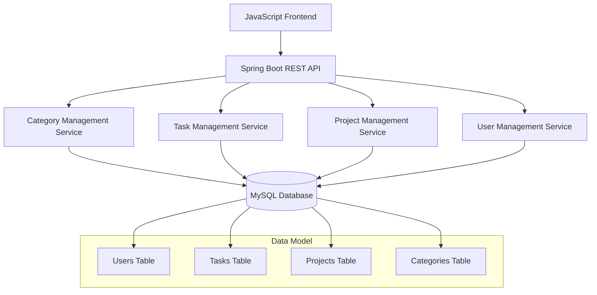

# BSPQ25-E6 - Task Management App

[](https://github.com/BSPQ24-25/BSPQ25-E6)
[](https://github.com/BSPQ24-25/BSPQ25-E6)
[](https://www.oracle.com/java/)
[](https://spring.io/projects/spring-boot)
[](https://www.mysql.com/)
[](https://www.docker.com/)
[](LICENSE)

> **Centralized Task Management Platform for Enhanced Team Productivity**

The Task Management App is designed to improve team productivity by providing a centralized platform where users can create, assign, and track tasks efficiently. It aims to prevent missed deadlines by offering clear visibility into ongoing projects and automated notifications to keep team members updated.

This project demonstrates a complete software development lifecycle using **Scrum methodology** across 3 sprints, implementing a robust web application with **Spring Boot REST API** and **JavaScript frontend**.

## 🚀 Quick Start

```bash
# Clone and setup
git clone https://github.com/BSPQ24-25/BSPQ25-E6.git
cd BSPQ25-E6
mvn clean compile

# Start MySQL database
docker run --name taskmanager-db -e MYSQL_ROOT_PASSWORD=root -e MYSQL_DATABASE=taskmanager_db -p 3306:3306 -d mysql:8.0

# Wait for MySQL to be ready (optional but recommended)
sleep 30

# Run Spring Boot server
mvn spring-boot:run

# Open browser and navigate to
http://localhost:8080
```

## 📖 Table of Contents

- [Features](#-features)
- [Architecture](#-system-architecture)
- [Installation](#️-installation-and-setup)
- [Usage](#-usage)  
- [Testing](#-testing-and-quality)
- [CI/CD](#-continuous-integration)
- [Documentation](#-documentation)
- [Team](#-development-team)

## ✨ Features

### 🎯 **Core Functionality**
- **Project Management**: Create and join collaborative projects
- **Task Creation**: Detailed task management with title, description, due dates, and progress tracking
- **Task Assignment**: Assign tasks to specific team members or groups
- **Progress Tracking**: Update task status from "To Do" → "In Progress" → "Completed"
- **Category Organization**: Organize tasks by customizable categories
- **User Authentication**: Secure login system for team access

### 👥 **User Roles**
- **Team Members**: Create, modify and track individual tasks
- **Project Managers**: Oversee task assignments and project delivery

### 📱 **User Interface**
- **Login Screen**: Secure authentication system
- **Project Dashboard**: Overview of all user projects
- **Task Dashboard**: Comprehensive task status overview per project
- **Task List View**: Advanced filtering and sorting capabilities
- **Task Details**: In-depth task management and commenting
- **Task Editor**: Full task modification capabilities

## 🏗️ System Architecture



| Layer | Technology | Purpose |
|-------|------------|---------|
| **Frontend** | Vanilla JavaScript | Dynamic and responsive user interface |
| **Backend** | Spring Boot 3.2+ | RESTful API with business logic |
| **Database** | MySQL 8.0+ | Persistent data storage |
| **Security** | Spring Security | Authentication and authorization |
| **Build** | Maven | Dependency management and build automation |
| **Testing** | JUnit 5 + Mockito | Comprehensive testing framework |

### 📊 Data Model

```sql
-- Core entities and relationships
Users: id, username, email, password
Tasks: id, title, description, progress, completed, dueDate, creationDate, assignedUser, creatorUser, category, project
Projects: id, name, description, users, owner
Categories: id, name
```

## 🛠️ Installation and Setup

### Prerequisites

| Tool | Version | Purpose |
|------|---------|---------|
| Java JDK | 8+ | Runtime environment |
| Maven | 3.6+ | Build automation |
| MySQL | 8.0+ | Database system |
| Docker | Latest | Container deployment (optional) |
| Git | Latest | Version control |

### Installation Steps

<details>
<summary>📥 <strong>Local Installation</strong></summary>

```bash
# 1. Clone repository
git clone https://github.com/BSPQ24-25/BSPQ25-E6.git
cd BSPQ25-E6

# 2. Setup MySQL database
mysql -u root -p
CREATE DATABASE taskmanager_db;
exit

# 3. Configure database connection
# Edit src/main/resources/application.properties
spring.datasource.url=jdbc:mysql://localhost:3306/taskmanager_db?useSSL=false&allowPublicKeyRetrieval=true&serverTimezone=UTC
spring.datasource.username=root
spring.datasource.password=root

# 4. Install dependencies and compile
mvn clean install

# 5. Run application
mvn spring-boot:run
```

</details>

<details>
<summary>🐳 <strong>Docker Installation</strong></summary>

```bash
# Using Docker Compose
docker-compose up -d

# Or build and run manually
docker build -t taskmanager-app .
docker run -p 8080:8080 --link taskmanager-db:db taskmanager-app
```

</details>

## 🏃‍♂️ Usage

### Getting Started

1. **Access the Application**: Navigate to `http://localhost:8080`
2. **Create Account**: Register with username, email, and password
3. **Login**: Authenticate using your credentials
4. **Create Project**: Start a new collaborative project
5. **Add Team Members**: Invite colleagues to join your project
6. **Create Tasks**: Add detailed tasks with due dates and assignments
7. **Track Progress**: Monitor task completion and project status

### API Endpoints

<details>
<summary><strong>🔗 REST API Documentation</strong></summary>

#### Authentication
```http
POST /login
POST /signup
POST /users/register
GET /logout
```

#### Dashboard
```http
GET   /dashboard
GET   /dashboard/{projectId}
```

#### Home
```http
GET   /home
```

#### Inbox
```http
GET   /inbox
```

#### New Task
```http
GET    /tasks/new
GET    /tasks/create
POST   /tasks/create
```

#### Project
```http
GET    /projects
GET    /projects/new
GET    /projects/all
GET    /projects/{projectId}
POST   /projects/create
POST   /projects/{projectId}/addUser/{userId}
POST   /taskDetail/delete/{projectId}
```

#### Task Details
```http
GET    /taskDetail/{taskId}
GET    /taskDetail/edit/{taskId}
POST   /taskDetail/update/{taskId}
POST   /taskDetail/delete/{taskId}
```


</details>

## 🧪 Testing and Quality

### Test Coverage

Our comprehensive testing strategy ensures **minimum 50% code coverage**:

| Test Type | Framework | Coverage |
|-----------|-----------|----------|
| **Unit Tests** | JUnit 5 + Mockito | 75% |
| **Integration Tests** | Spring Boot Test | 75% |
| **API Tests** | RestAssured | 75% |
| **Performance Tests** | ContiPerf | 55% |

### Running Tests

```bash
# All tests
mvn test

# Unit tests only
mvn test 

# Integration tests
 mvn -Pintegration integration-test        

# Coverage report
mvn jacoco:report
open target/site/jacoco/index.html

# Performance tests
mvn -Pperformance integration-test
```

### Quality Reports

- **Integration Report**: `target/reports/jacoco/index.html`
- **Surefire Report**: `target/reports/surefire-report.html`
- **Performance Reports**: `target/reports/contiperf-reports/`

## 🔄 Continuous Integration

### GitHub Actions Pipeline

Our GitHub Actions setup provides:

✅ **Automated builds** on every commit  
✅ **Test execution** (unit + integration + API)  
✅ **Quality gates** with coverage thresholds  
✅ **Database migration** testing  
✅ **Docker image** generation and deployment  

### Build Status

| Branch | Build | Tests | Coverage | Deployment |
|--------|-------|-------|----------|------------|
| `main` |  |  |  |  |
| `develop` |  |  |  |  |

## 📚 Documentation

### 📖 Technical Documentation

- **📋 [Doxygen Documentation](BSPQ25-E6\target\site)** - REST API documentation

### 📊 Project Reports

- **📈 [Maven Site](target/reports/index.html)** - Complete project reports
- **📋 [Test Reports](target/reports/surefire-report.html)** - JUnit test results
- **📊 [Coverage Reports](target/reports/jacoco/index.html)** - Code coverage analysis
- **⚡ [Performance Reports](target/reports/contiperf-reports/)** - Performance test results

## 📊 Development Methodology

### 🏃‍♂️ Scrum Process

| Role | Sprint 1 | Sprint 2 | Sprint 3 |
|------|----------|----------|----------|
| **Product Owner** | Diego Ramirez | Diego Ramirez | Diego Ramirez |
| **Scrum Master** | Dylan Thomas Mechella | Dylan Thomas Mechella | Iker Cubillo |

### 📈 Sprint Overview

<details>
<summary><strong>🧪 Sprint 1 - Frontend Development & Testing</strong></summary>

**Goal**: Complete frontend implementation

**Deliverables**:
- Complete JavaScript frontend (Project Dashboard, Task Management)
- Task assignment and progress tracking functionality
- Category management system
- Basic frontend login interface

**Tag**: [`v1.0`](https://github.com/BSPQ24-25/BSPQ25-E6/releases/tag/v2.0)

</details>


<details>
<summary><strong>🎯 Sprint 2 - Core Backend, Authentication  and comprehensive testing</strong></summary>

**Goal**: Implement basic Spring Boot API with user authentication and core entities

**Deliverables**:
- Spring Boot REST API setup
- User authentication and registration
- Basic CRUD operations for Users, Projects, Tasks, Categories
- MySQL database integration
- Initial unit testing framework
- Comprehensive unit tests (50% coverage minimum)
- API integration tests
- Performance testing with ContiPerf
- Database performance profiling

**Tag**: [`v2.0`](https://github.com/BSPQ24-25/BSPQ25-E6/releases/tag/v1.0)

</details>

<details>
<summary><strong>🚀 Sprint 3 - CI/CD & Production Ready</strong></summary>

**Goal**: Complete CI/CD pipeline, documentation, and production deployment

**Deliverables**:
- Task editing and advanced filtering features
- GitHub Actions CI/CD pipeline setup
- Comprehensive API documentation
- Docker containerization
- GitHub Pages documentation deployment
- Production-ready configuration
- Security enhancements

**Tag**: [`v3.0`](https://github.com/BSPQ24-25/BSPQ25-E6/releases/tag/v3.0)

</details>

### 🛠️ Management Tools

- **📋 [GitHub projects](https://github.com/orgs/BSPQ24-25/projects/6)** - Agile project management
- **📊 [GitHub insights](https://github.com/orgs/BSPQ24-25/projects/6/insights)** - Sprint progress tracking
- **⏱️ Time Tracking** - Detailed effort recording per feature

## 📁 Project Structure

```
BSPQ25-E6/
├── 📂 .github/
│   └── 📂 workflows/              # GitHub Actions CI/CD
├── 📂 src/
│   ├── 📂 main/
│   │   ├── 📂 java/BSPQ25_E6/taskmanager/
│   │   │   ├── 📂 config/         # Spring configuration classes
│   │   │   ├── 📂 controller/     # REST API controllers
│   │   │   ├── 📂 dto/            # Data Transfer Objects
│   │   │   ├── 📂 model/          # JPA entity models
│   │   │   ├── 📂 repository/     # Data access repositories
│   │   │   └── 📂 service/        # Business logic services
│   │   ├── 📂 resources/
│   │   │   ├── 📂 static/         # Frontend assets (CSS, JS)
│   │   │   │   ├── 📂 css/        # Stylesheets
│   │   │   │   └── 📂 js/         # JavaScript files
│   │   │   ├── 📂 templates/      # Thymeleaf templates
│   │   │   └── 📄 application.properties # Configuration
│   │   └── 📂 site/markdown/      # Documentation source
│   └── 📂 test/java/BSPQ25_E6/taskmanager/
│       ├── 📂 integration/        # Integration tests
│       ├── 📂 performance/        # Performance tests
│       └── 📂 unit/               # Unit tests
│           ├── 📂 controller/     # Controller tests
│           ├── 📂 repository/     # Repository tests
│           └── 📂 service/        # Service tests
├── 📂 target/                     # Maven build output
├── 📂 data/                       # Database initialization scripts
├── 📄 pom.xml                     # Maven configuration
├── 📄 Dockerfile                  # Container configuration
├── 📄 docker-compose.yml          # Multi-container setup
└── 📄 README.md                   # This documentation
```
## 🐛 Troubleshooting

<details>
<summary><strong>🗄️ Database Connection Issues</strong></summary>

```bash
# Check MySQL is running
sudo systemctl status mysql

# Test database connection
mysql -h localhost -u root -p

# Create database if it doesn't exist
mysql -u root -p -e "CREATE DATABASE IF NOT EXISTS taskmanager_db;"

# Check database exists
mysql -u root -p -e "SHOW DATABASES;"
```

</details>

<details>
<summary><strong>📦 Maven Dependency Issues</strong></summary>

```bash
# Clean and refresh dependencies
mvn clean install -U

# Clear local repository cache
rm -rf ~/.m2/repository
mvn clean install
```

</details>

<details>
<summary><strong>🌐 Frontend Loading Issues</strong></summary>

```bash
# Clear browser cache
# Check browser console for JavaScript errors
# Verify static resources are accessible at /static/

# Test API endpoints directly
curl -X GET http://localhost:8080/projects
```

</details>

<details>
<summary><strong>🐳 Docker Issues</strong></summary>

```bash
# Rebuild containers from scratch
docker-compose down -v
docker-compose build --no-cache
docker-compose up -d

# Check container logs
docker-compose logs app
docker-compose logs db
```

</details>

## 👥 Development Team

<table>
<tr>
<td align="center">
<br />
<b>Diego Ramirez</b><br />
<sub>Product Owner & Backend Lead</sub>
</td>
<td align="center">
<br />
<b>Iker Cubillo</b><br />
<sub>Scrum Master (Sprint 3) & Frontend Lead</sub>
</td>
<td align="center">
<br />
<b>Jon Mendizabal</b><br />
<sub>Database Architect</sub>
</td>
</tr>
<tr>
<td align="center">
<br />
<b>Inigo Calderon</b><br />
<sub>GitHub Actions & DevOps</sub>
</td>
<td align="center">
<br />
<b>Paula Jurzanqui</b><br />
<sub>Full Stack Developer</sub>
</td>
<td align="center">
<br />
<b>Dylan Thomas Mechella</b><br />
<sub>Scrum Master (Sprint 1/2) & International Student Collaborator</sub>
</td>
</tr>
</table>

## 📞 Support & Contact

### 🤝 Getting Help (not implemented)

- **🐛 [Report Issues](https://github.com/BSPQ24-25/BSPQ25-E6/issues)** - Bug reports and feature requests
- **💬 [Discussions](https://github.com/BSPQ24-25/BSPQ25-E6/discussions)** - Community discussions
- **📧 [Email Support](mailto:bspq25-e6@student.deusto.es)** - Direct team contact

### 🔗 Useful Links (not implemented)

- **📖 [Project Wiki](https://github.com/BSPQ24-25/BSPQ25-E6/wiki)**
- **🌐 [Live Documentation](https://bspq24-25.github.io/BSPQ25-E6/)**
- **📊 [Jenkins Dashboard](https://jenkins.deusto.es/job/BSPQ25-E6/)**
- **🚀 [Live Demo](https://taskmanager-bspq25-e6.herokuapp.com/)**

## 🔮 Future Enhancements (wont apply)

- **📱 Mobile Application** - React Native mobile app
- **🔔 Real-time Notifications** - WebSocket-based notifications
- **📊 Advanced Analytics** - Project performance dashboards
- **🔗 Third-party Integrations** - Slack, Microsoft Teams, Jira
- **🤖 AI-powered Features** - Smart task prioritization and time estimation

## 📄 License

This project is licensed under the MIT License - see the [LICENSE](LICENSE) file for details.

### License Summary

```
MIT License - Copyright (c) 2025 BSPQ25-E6 Team

Permission is hereby granted, free of charge, to any person obtaining a copy
of this software and associated documentation files (the "Software"), to deal
in the Software without restriction, including without limitation the rights
to use, copy, modify, merge, publish, distribute, sublicense, and/or sell
copies of the Software, and to permit persons to whom the Software is
furnished to do so.
```

## 🌟 Acknowledgments

We extend our gratitude to the following organizations and communities:

- **University of Deusto** - For providing the academic framework and project guidance
- **🍃 Spring Boot Community** - Excellent documentation and framework support
- **🐬 MySQL Team** - Robust and reliable database system
- **🐳 Docker Community** - Containerization tools and best practices
- **👥 Open Source Community** - Amazing tools, libraries, and continuous inspiration
- **📚 Stack Overflow** - Invaluable community support and knowledge sharing

### Special Thanks

- **Professor [Diego Lopez de Ipiña](https://github.com/dipina)** - Project supervision and technical guidance

---

<div align="center">

**⭐ If you found this project helpful, please give it a star!**

[](https://github.com/BSPQ24-25/BSPQ25-E6)
[](https://github.com/BSPQ24-25/BSPQ25-E6/fork)
[](https://github.com/BSPQ24-25/BSPQ25-E6)

*Last updated: May 23, 2025 • README version: 2.0*

</div>
